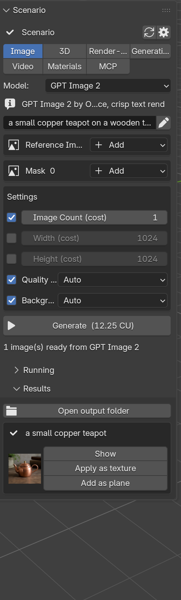
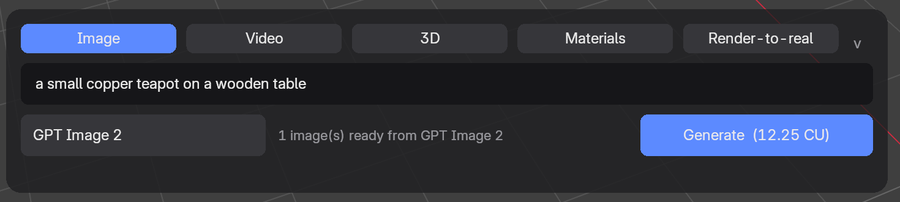
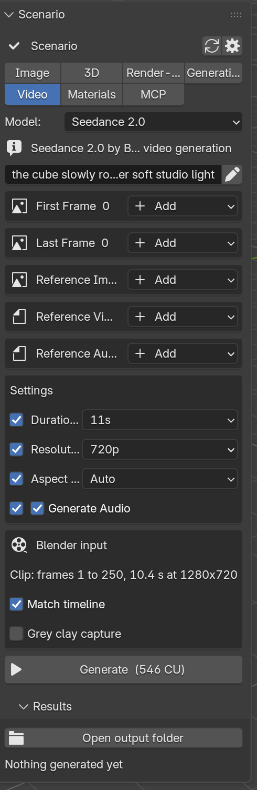
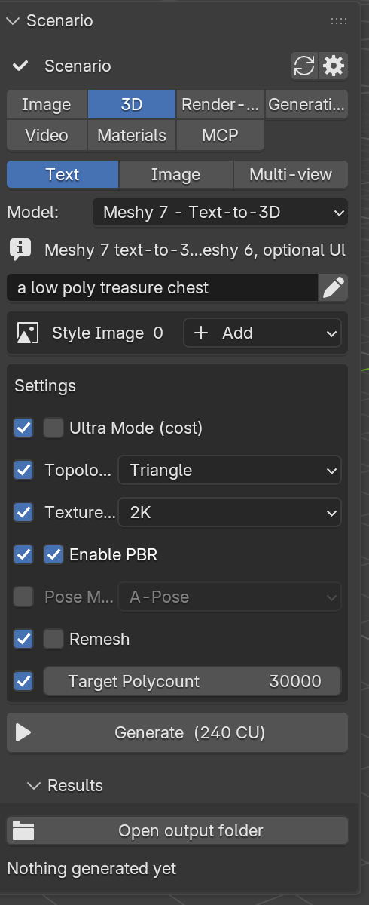
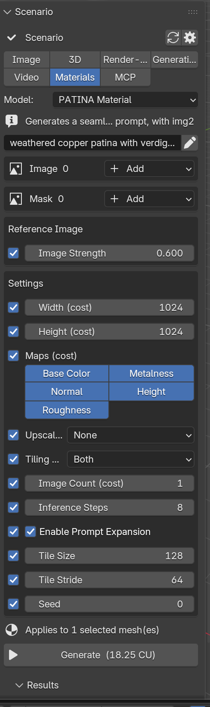
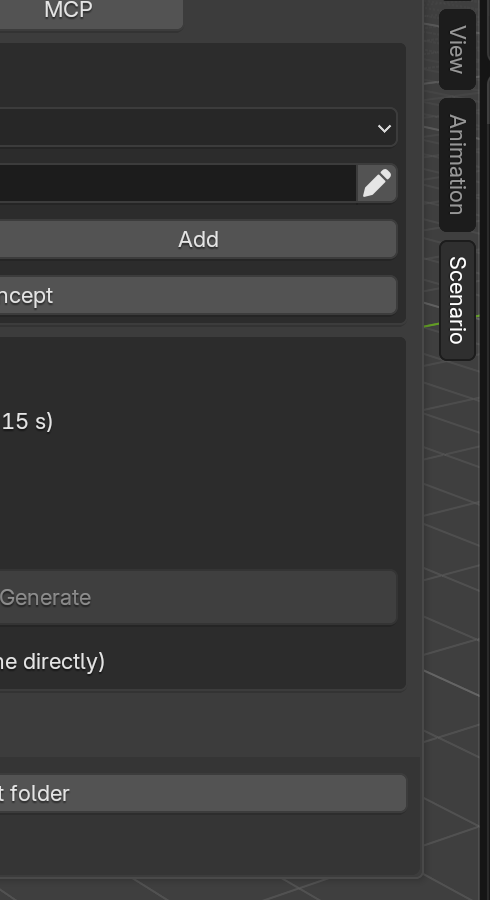
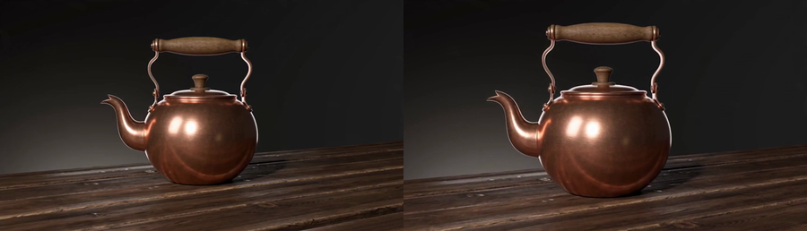
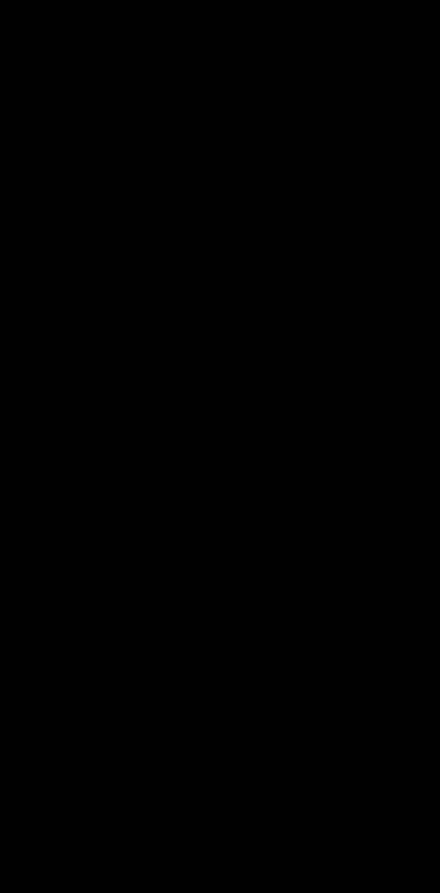
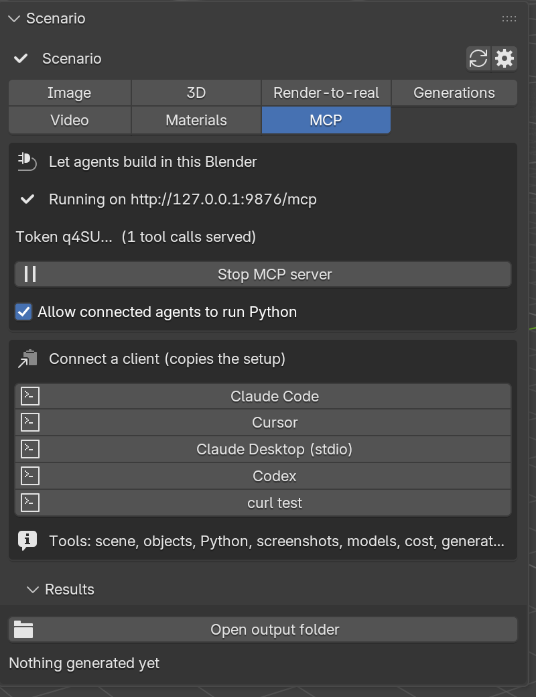

# Scenario for Blender: user guide

Version 0.5.2, 2026-08-28. Blender 4.2 or newer (tested on 5.1), a Scenario account with API access (Pro plan or above), an internet connection.

## What it does

Scenario for Blender puts Scenario's generation models inside Blender's 3D viewport. From one panel you generate images, videos, 3D models and PBR materials, feed them with what is already in your scene (a viewport capture, the scene camera, a playblast of your animation, a render), and get the results back where you work: images as datablocks and textures, meshes at the 3D cursor, materials on the selected objects, videos in your output folder. Every generation shows its price in Creative Units (CU) before you press Generate, charged to the Scenario workspace of your API key.

The add-on also runs a small local MCP server, so an agent such as Claude Code, Cursor or Claude Desktop can read your scene, run tools in Blender and generate with Scenario, with your consent switches.

## Install

1. Download `scenario-<version>.zip` from the [releases page](https://github.com/edemaistre/scenario-for-blender/releases) (or build it with `./tools/build.sh`). Keep it zipped.
2. Drag the zip onto any Blender window, or use Edit > Preferences > Get Extensions > Install from Disk. Blender installs it into your user extensions and enables it. Updating: install the new zip the same way; Blender replaces the old version. Restart Blender after an update so the new code loads.
3. Create an API key in Scenario: Team > API Keys, Project or Team scope, role Editor. The secret is shown once.
4. Edit > Preferences > Add-ons > Scenario: paste the key and the secret, press Test connection. Pick an Output Folder (default `~/Downloads/Scenario`). Blender's Allow Online Access must be on (System preferences).

Where things are:
- The **Scenario tab** in the 3D viewport sidebar (press `N`, pick the Scenario tab).
- The **Scenario button** in the viewport header (a compact popover: lane, model, prompt, Generate).
- The **floating composer**, a pill at the bottom of every 3D viewport (see below).

## The panel

From top to bottom:
- **Account strip**: your team and project, a refresh button for the model list, a shortcut to the preferences.
- **Lane tabs**: Image, Video, 3D, Materials, Render-to-real, MCP, Generations.
- **Model**: the models usable in this lane, curated ones first. The one-line description comes from the Scenario catalog.
- **Prompt**: one line; the pencil opens a wider editor.
- **References**: one box per file input the model accepts (image, video, audio, 3D). Add offers File, Viewport still, Camera still, Viewport clip, Camera clip and Render Result. Captures happen when you press Generate, not when you add them.
- **Parameters**: built from the model's own schema. A checkbox in front of an optional parameter means "send this value"; unchecked, Scenario uses its default. `(cost)` marks parameters that change the price.
- **Generate (N CU)**: the exact price of this form, refreshed as you edit (a dry run, free). "from N CU" means the quote excludes references that will only be uploaded at generate time.
- **Running** shows jobs in flight with progress; **Results** lists finished jobs with actions per kind (Show, Apply as texture, Add as plane, Import, Play, Tiling).

Results are saved under the Output Folder: `images/`, `videos/`, `3d/`, `materials/`, named `<date>_<model>_<job>_<n>.<ext>`.

## Lanes

### Image
Text or reference images to images (GPT Image 2, Gemini 3.1, Seedream, Z-Image and any other txt2img/img2img model). Results open in an Image Editor and appear in Results with **Show**, **Apply as texture** (a material with the image as Base Color on the active mesh) and **Add as plane** (a view-facing plane at the 3D cursor).

### Video
Text, images or your Blender scene to video (Seedance 2.0 and 2.5, Kling, Veo, Wan and the other video models).

- **Viewport clip** / **Camera clip** references playblast your timeline at 1280x720 (overlays hidden) when you press Generate. **Grey clay capture** forces solid single-colour shading so the model reads motion rather than materials.
- **Match timeline** sets the clip duration from your frame range, rounded up to a value the model accepts; clips shorter than 4 s are padded, longer ones are trimmed to the model's maximum. Seedance prompts get their `@video1` / `@image1` mentions automatically.
- Results: **Play** (system player) or **Play in Blender**.

### 3D
Three modes: **Text**, **Image** (one picture) and **Multi-view** (several views of the same object, first one is the front).

Models: Meshy 7 and Rodin Gen-2.5 for text; Tripo 3.1, Tripo P1, Meshy 7, Hunyuan 3.1 Pro, Rodin 2.5 for images; Meshy 7 Multi Image, Tripo 3.1 Multi View, Hunyuan 3.1 Pro Multiview and Rodin for multi-view. The result is imported at the 3D cursor into a "Scenario" collection and the viewport switches to Material Preview so the textures show. Providers return several variants of one result (Meshy: GLB, OBJ and texture PNGs; Rodin with `material=All`: a shaded and a PBR mesh): the add-on imports one primary mesh (the textured GLB) and lists the other files in Results with an **Import** button. Rodin defaults to PBR.

### Materials
Patina turns a prompt (or a photo) into a seamless PBR set: base color, normal, roughness, metalness, height.

Select the meshes to texture, describe the material, choose the maps and size, Generate. The material arrives as a Principled BSDF with UV mapping and displacement and is applied to the meshes you had selected. **Tiling** in Results scales the mapping. Three models: PATINA Material (prompt, with variation and inpainting), PATINA Image to Maps (a flat texture or photo to maps), PATINA Material Extract (isolate one material from a photo).

### Render-to-real
Two steps to turn a grey animation into a finished-looking clip.

1. **Concept look**: pick the source (scene camera or viewport), describe the look, optionally add style references, press **Render concept**. A styled still of your capture comes back.
2. **Playblast and Generate**: the timeline is playblasted (grey clay by default) and sent to Seedance 2.0 with the concept as style reference and a prompt that tells the model to keep the motion and framing of the playblast.

Tip from the first tests: include a ground plane in the playblast so the model understands how the subject moves relative to the floor.

### Generations
The project's cloud history: prompt, kind, price, status. **Import into scene** brings a result into Blender (downloading it if needed), also for generations made on the web app or by an agent. **Load older** pages back in time.

### MCP (agents)
The add-on serves the Model Context Protocol on `http://127.0.0.1:9876/mcp` with a token that changes every Blender session.

- Pick a client and press its button: the setup is copied to the clipboard (Claude Code command, Cursor `mcp.json`, Claude Desktop stdio snippet, Codex command, or a curl test).
- **Allow connected agents to run Python** gates the `execute_python` tool. Off, agents keep the other 15 tools: scene summary, object detail, select, set frame, screenshots, quick renders, list models, model schema, cost estimate, generate, job status, wait, import result, capture a viewport reference, list generations.
- Headless: `blender --background scene.blend --command scenario-mcp --port 9876 --token <token>`.

## The floating composer

The pill at the bottom of the viewport shows the current prompt and a Generate button. Click it to expand: lane tabs, the prompt (click to edit: type, arrows, Home/End, Ctrl/Cmd+V to paste, Ctrl/Cmd+A to select all, Enter to generate, Esc to leave), the model chip (opens the Scenario tab) and Generate with the price. Click the small chevron or outside the card to collapse. The composer and the panel are two views of the same form. If drawing ever fails repeatedly it switches itself off; re-enable it in Preferences (Floating composer in the viewport).

## Costs

Prices are in CU and depend on the model and its cost-marked parameters. Observed during the build (August 2026): an image 9 to 13 CU, a Patina material 6 to 18 CU, Tripo 3.1 image to 3D 45 CU, Rodin 2.5 80 CU, Meshy 7 text to 3D 240 CU, Seedance 2.0 76 CU for 4 s at 480p and 546 CU for 11 s at 720p. The quote on the Generate button is exact for the form you see.

## Troubleshooting

- **"Loading models..." does not end**: check the key and secret in Preferences (Test connection), and Blender's Allow Online Access. A Retry button appears when the catalog request failed.
- **"Prompt is required" / "Add a reference to see the cost"**: the quote needs a valid form; fill the prompt or add the required reference.
- **The result does not appear**: open Results. A job that failed to download says so with the reason; use Generations > Import into scene to fetch it again. After installing an update, restart Blender so the new version loads.
- **A 3D model looks untextured**: switch the viewport to Material Preview (the add-on does this on import since 0.5.1), and check Results for the imported file name.
- **Two meshes from one job**: versions before 0.5.1 imported every variant; update, or delete the extra object.
- **Nothing generates from Enter or a click**: with `SCENARIO_GUI_PROBE=1` in the environment (used by the automated screenshot tool) all Generate paths are disabled.
- **Where are the logs**: Blender's system console (Window > Toggle System Console on Windows, the terminal on macOS/Linux), messages are prefixed `scenario`.

## Files and folders

- Results: your Output Folder (`~/Downloads/Scenario` by default).
- Captures used as references: the extension cache (`captures/` under Blender's extension user directory).
- Job registry and model cache: the extension state and cache directories; removed when the extension is uninstalled.
- Your key: Blender's preferences file. Treat it like any credential; rotate it in Scenario if it leaks.

## Known limits

See `BUGS.md`. Notably: the prompt is single-line in the composer (the pencil opens a wider editor), captures need the Blender GUI, team-scoped keys need a project switcher that does not exist yet, and skyboxes, mesh utilities, rigging and motion models are planned for v2.
